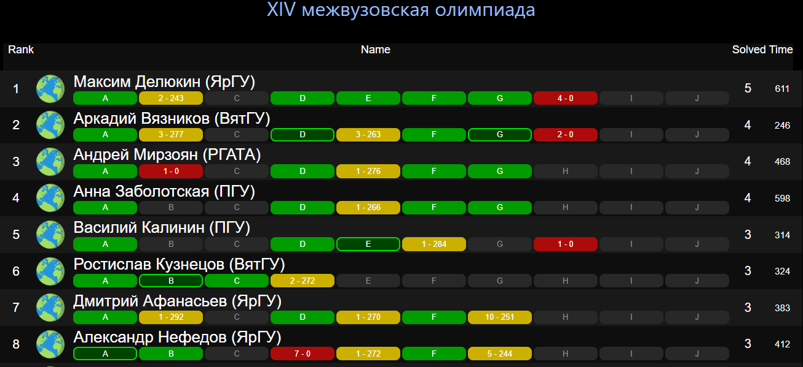

# neoSaris - ICPC Standings Resolver



The code of this repository contains a react app that can be used to simulate what happens in the frozen time during a competitive programming competition with the ICPC standard rules.

Its UI is inspired by the [ICPC Resolver](https://tools.icpc.global/resolver/).
The name `neoSaris` is inspired by the original [S4RiS](https://github.com/OStrekalovsky/S4RiS-StanD), which development has been stopped since 2014. This neo version of S4RiS, is built from scratch and does not share any code with the original project.

This repository, is a hard-fork of the original (and abandoned) [SarisByAlgoritmiaESCOM](https://github.com/galloska/SarisByClubAlgoritmiaESCOM) created by [galloska](https://github.com/galloska), we decided to improve this project by refactoring major pieces, and integrating it with external platforms to be easier to use.

## How to Use

This tool is available on **[saris.huronos.org](https://saris.huronos.org)** thanks to the huronOS project who is providing the hosting.
You can either use it online as a web client, or you can install it locally following the [installation](#Installation) steps.

### Commands

**(N)ext Submission** `(press: n)`  
**1st** `n`, the UI goes to the next pending submission from bottom to top, and highlight it to let the user know that is the next pending submission to reveal.  
**2nd** `n`reveals the selected pending submission.

**(U)nfroze Standings** `(press: u)`  
Reveals the final standings.

**(T)op 10 Standings** `(press: t)`  
Reveals standing until the top 10. That means the top 10 will be in the frozen stage and then you can go one by one revealing the results.

## Why a [another] ICPC Resolver?

The current solutions like the official _ICPC Resolver_, require a lot of setup to make them work, other ones like the original S4RiS are abandoned. Added to this, any of them have integrations that allows them to be easier to use with popular platforms like _Codeforces_ which are commonly used to held official competitions, or annual contests.

The main purpose of **neoSaris** is to facilitate the access to a resolver without requiring to install a lot of stuff or the need to parse a lot of data to be used. That's why neoSaris is mounted on web which can be accessed by anyone at anytime, and just by filling some form data, they're ready to unfreeze their standings.

## Online Judges Integrations

Currently, neoSaris uses a data format described on the following subsection. But it have some integrations with:

- Codeforces
- vJudge

So that saris automatically parse data (from API or another data syntax) to the required Saris Raw Data format.

### neoSaris JSON

The resolver needs a JSON input format that follows object model of [example.json](https://github.com/equetzal/SarisResolver/tree/public/example.json):

```json
{
  "contestMetadata": {
    "duration": 300,
    "frozenTimeDuration": 60,
    "name": "Trial Contest",
    "type": "ICPC"
  },
  "problems": [
    { "index": "A" },
    { "index": "B" },
    { "index": "C" },
    { "index": "D" },
    { "index": "E" },
    { "index": "F" },
    { "index": "G" },
    { "index": "H" },
    { "index": "I" },
    { "index": "J" }
  ],
  "contestants": [
    { "id": 1, "name": "Red Panda" },
    { "id": 2, "name": "Moscow IPT 1" },
    { "id": 3, "name": "Moscow IPT Jinotega" }
  ],
  "verdicts": {
    "accepted": ["Accepted"],
    "wrongAnswerWithPenalty": ["Wrong answer"],
    "wrongAnswerWithoutPenalty": ["Compilation error"]
  },
  "submissions": [
    {
      "timeSubmission": 47,
      "teamName": "Moscow IPT Jinotega",
      "problem": "A",
      "verdict": "Accepted"
    },
    {
      "timeSubmission": 260,
      "teamName": "Moscow IPT 1",
      "problem": "H",
      "verdict": "Wrong answer"
    },
    {
      "timeSubmission": 270,
      "teamName": "Moscow IPT 1",
      "problem": "A",
      "verdict": "Accepted"
    }
  ]
}
```

**Contest:** The Contest part contains information about the competition such as duration, frozen time, the number of problems and the name of the contest.

**Teams:** In the team’s part the key value is the identifier of the team and it is followed by the name of the team. The key value must be unique for each team.

<!-- and if you want show an image related with that team, you can copy the image to [src/university_logos](https://github.com/galloska/SarisByClubAlgoritmiaESCOM/tree/master/src/university_logos) and rename it to `key.png` where 'key' is the key value in the JSON file for that team.
-->

**VerdictWithoutPenalty:** This includes those verdicts that does not affect penalty time for teams. For example, in some contest a runtime error adds penalty time and in some others this verdict is not considered for a penalty.

**Submissions:** An array containing the submissions of the contest. Each submission must have the time submission in minutes, the team that submitted the solution, the problem that was submitted and the verdict.

Verdicts can be anything you want except the Accepted verdict that must be **Accepted**.

### Codeforces

Currently, neoSaris is integrated with the [Codeforces API](https://codeforces.com/apiHelp). This integration will let you access the contests API and parse its responses to the Saris format, allowing you to unfreeze the standing.

#### Public Contests

For unfreezing public contests you will only need the contestId, this can be a gym contest or a codeforces managed contest. But we do not recommend unfreezing divisional contests as they might be too much data for the API and get a timeout.

#### Private Contests

To use this feature, toggle the Private contest switch, then the app will require the groupID, an API Key and API Secret of a **manager** user of the **private group** you want to access.
We know this is sensible data, so these keys are only used on this react app as a client (they only live in your browser), and they are only sent to codeforces via their API.
You can verify this on the [implementation](./src/parsers/codeforces/codeforces-api-parser.js).

#### IMPORTANT

- The user which provides the API Key and the API Secret needs to be manager of the contest in order to query the Status of the contest.
- Also, due to the design of the API, **the status do not provide unfrozen standings**, so it will be necessary to unfroze the standing for a bit when loading the resolver, and then they can be frozen again.

### vJudge

Currently, vJudge does not provide a public API but it does have an API for its own frontend which can be accessed by foreign applications.

#### Public contests

To unfreeze the public contests just use the contestId, and Saris will prepare the standing.
Note that currently vJudge do not froze standings, so you might only want to use Saris with vJudge when revealing prizes.

#### Private contests

Unfortunately vJudge API does not provide an authentication method, it requires of the user _cookies_ in order to provide a response for **private contests**. We cannot integrate a foreign cookie in our requests as that would be a violation almost all browsers security policies. But a local client (node) which is not ran within a browser, can use the cookie to request the API.

To do this, please:

1. Download the repo as `git clone https://github.com/equetzal/SarisResolver`
2. Make sure to be logged in vJudge, and to be manager of the private contest you want to unfreeze.
3. Go to the rank page of the contest, press `ctrl + shift + i` to open the page inspector.
4. Open the network tab and reload the page.
5. Look for the last request with the number of the contest which endpoint is `https://vjudge.net/contest/rank/single/`
6. Check the request headers, and copy the `cookie` header.
7. Go to the repository and replace the values for this command:
   ```bash
   node src/parsers/vjudge/vjudge-api-parser-private.js $FROZEN_TIME_MINUTES $CONTEST_ID $NUMBER_OF_PROBLEMS "$COOKIE" $OUTPUT_FILE
   ```
   It's important to notice that the cookie must be a string to work.
8. Open the `$OUTPUT_FILE` you specified, and you'll find the Raw Data required to run Saris.
9. Copy and paste all the content of the Raw Data, on the Saris Raw Data source.
10. Click on `Start Dancing`

### Other OJ

Feel free to add parsers to the [src/parsers](src/parsers/) directory to then be integrated with the React App. Here you can add static parsers (from text to the required JSON format), or API parsers that integrates Saris directly to another online judge.

### Local Installation

To run this tool first you need to get the repository. You can either download the source code in your computer or run the following command:

`git clone https://github.com/equetzal/SarisResolver.git`

Once you have downloaded the source code you need to install the dependencies of the project with the following command on the root folder of this project:

`npm install`

Once you have run this command, just type next command in the root folder of the project and start using Saris:

`npm start`

### Contribute!

This project is open for contributions, currently there's some goals planned:

- [x] Support Codeforces API
- [ ] Fully refactor the project to use React functional components
- [ ] Migrate the project to Typescript
- [ ] Implement (F)ast Submission key command
- [ ] Implement (A)utomatic Reveal key command
- [ ] Support IOI-like contests (partial scoring)
- [x] Support vJudge API to unfroze standings
- [ ] Support BOCA for LATAM competitions.
- [ ] Add [CCS API](https://ccs-specs.icpc.io) compatibility (DOMjudge, Kattis, PC^2, ICPC CDS)
